<div align="center">

# 🏜️ Sahara & Sea
### A Tourist Attraction Recommender for Algeria

*Sign up, rate the places you love, and watch your personalized travel picks appear instantly.*

<br>


<br>

🎓 *Built for the Recommender Systems course — every algorithm written by hand, no ML libraries.*

</div>

---

## 📖 What is this project?

Imagine a travel app that learns your taste. You rate a few Algerian attractions
— the Roman ruins of Timgad, the dunes of Tassili n'Ajjer, the old Casbah of
Algiers — and it figures out **what else you'd probably love**, ranking the rest
of the country just for you.

That's **Sahara & Sea**. It's a complete, end-to-end recommender system:

- 🧹 It takes **messy real-world rating data** and cleans it up.
- 🧠 It compares **10 recommendation algorithms** (all written from scratch with NumPy).
- 🏆 It picks the best one and serves it through a **live website**.
- ⚙️ An **admin panel** lets you switch the live algorithm with one click — no restart.

> **New to recommender systems?** No problem. This README explains everything from
> the ground up. Start at [The big idea](#-the-big-idea-in-60-seconds) and read down.

---

## 🖼️ Screenshots

### 🌍 The public site

<div align="center">

**Home — "Find the places made for you"**
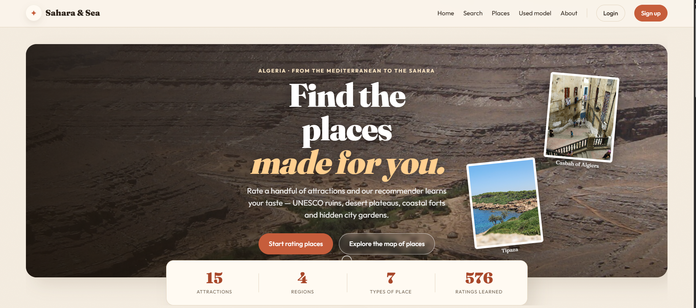

**🎯 "Picked for you" — personalized recommendations that update the moment you rate**
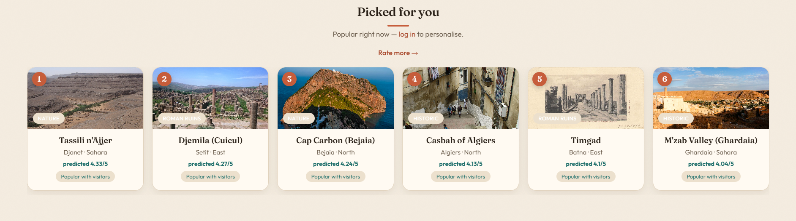

</div>

| 🔍 Search & browse | 📊 How the picks are made |
|:---:|:---:|
| 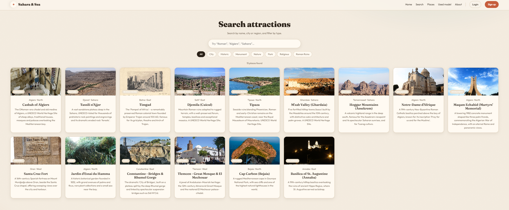 | 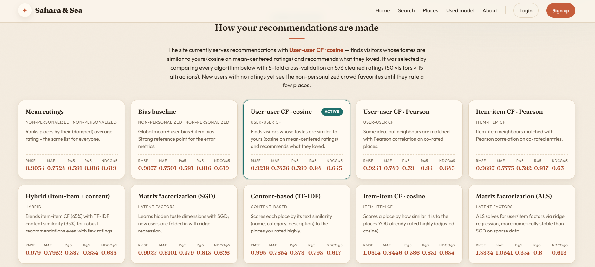 |
| *Search + filter the whole catalogue* | *Every algorithm explained, with its scores* |

| 🔑 Log in | ✍️ Sign up |
|:---:|:---:|
| 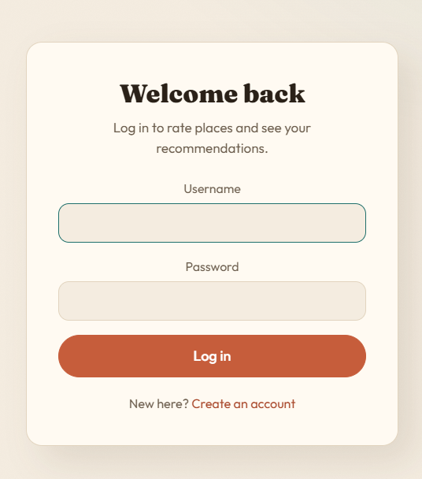 | 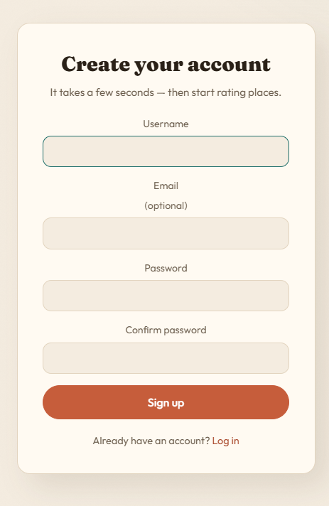 |
| *Welcome back* | *Create an account in seconds* |

### ⚙️ The hand-built admin panel

<div align="center">

**Dashboard — KPI cards, rating distribution & average-score-by-type charts**
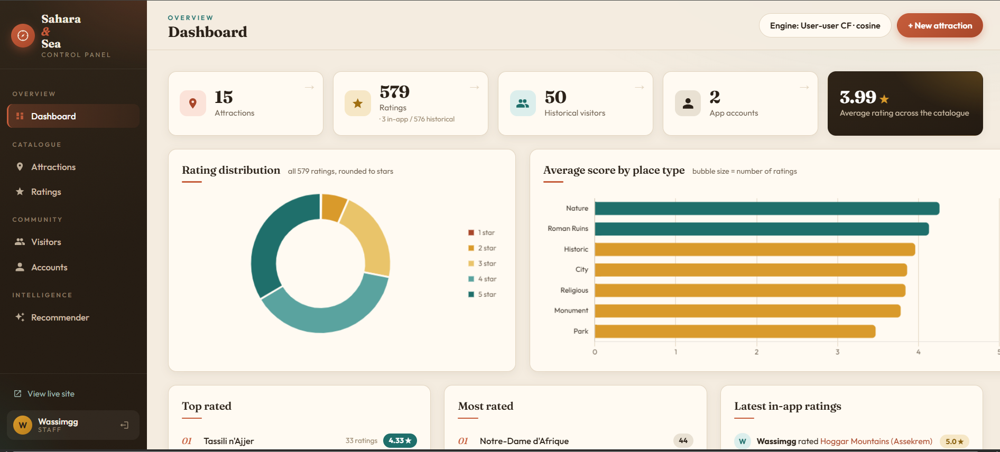

</div>

| 🔀 Switch the live algorithm | 📈 Cross-validated comparison |
|:---:|:---:|
| 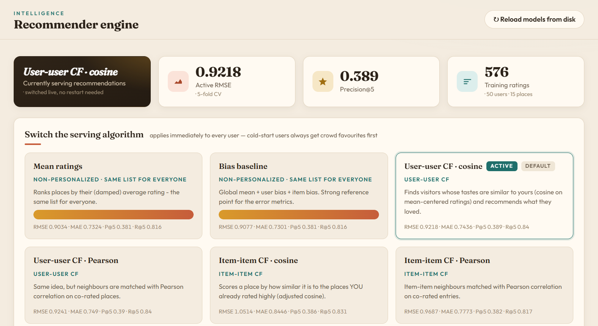 | 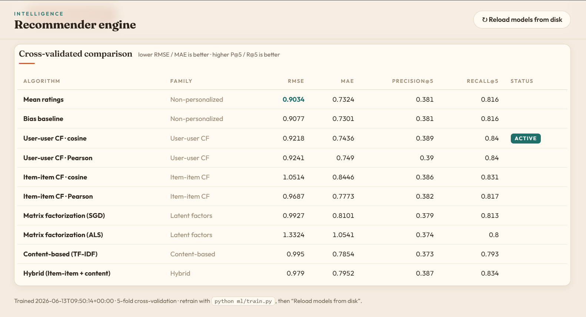 |
| *Pick a card → Apply → it's live, no restart* | *All 10 algorithms, every metric, side by side* |

| 🏛️ Attractions | ⭐ Ratings | 👥 Visitors |
|:---:|:---:|:---:|
| 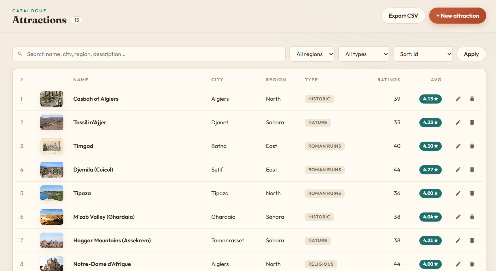 | 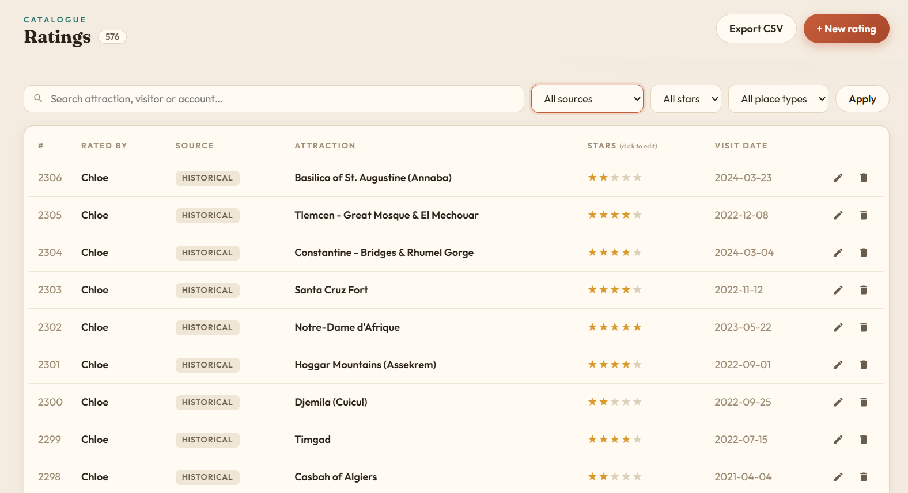 | 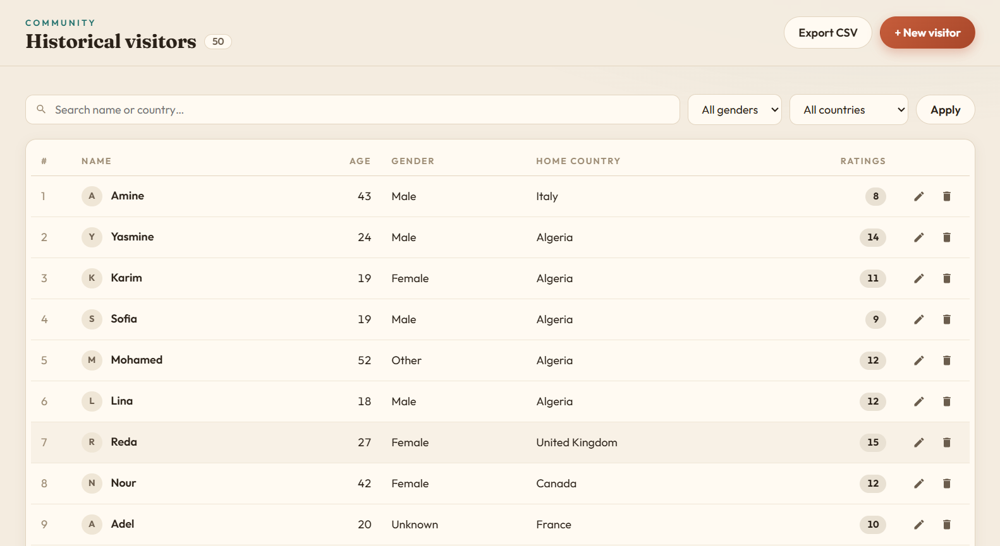 |
| *Search, filter, sort, CSV export* | *Click-to-edit stars inline* | *Manage the historical raters* |

---

## 💡 The big idea (in 60 seconds)

A **recommender system** answers one question: *"Given what this person liked
before, what should we show them next?"*

The most popular technique is **collaborative filtering**, and it comes in two flavors:

```
👥 USER-USER:  "People who rated places like YOU did, also loved Timgad."
                → Find your taste-twins, recommend what they enjoyed.

🏛️ ITEM-ITEM:  "You loved Tipaza. Djemila is very similar, so try that."
                → Find places similar to the ones you already rated highly.
```

There's also **content-based** filtering ("this place's *description* is similar to
ones you liked") and **matrix factorization** (find hidden "taste dimensions" with
math). This project implements **all of them** — and even a **hybrid** that blends two.

The clever part: when you rate something, we **don't retrain** anything. Your new
rating is folded into the math on the spot, so recommendations refresh instantly. ⚡

---

## ✨ Features

<table>
<tr>
<td width="33%" valign="top">

### 🌍 Public site
- Multi-page UI (Home, Places, Search, Model, About)
- Sign up / log in (hashed passwords, CSRF-safe)
- Rate any place 1–5★ → instant recommendations
- "Cold start": new users see crowd favorites
- Plain-English reasons on every pick
- Search, type filters, pagination, skeletons
- Fully responsive + reduced-motion friendly

</td>
<td width="33%" valign="top">

### 🧠 Recommender engine
- **10 algorithms**, all from scratch (NumPy)
- 5-fold cross-validation
- Metrics: RMSE, MAE, Precision@5, Recall@5, **NDCG@5**
- Diversity filter (no 5 identical place types)
- Per-user caching for speed
- The **live algorithm is switchable** at runtime

</td>
<td width="33%" valign="top">

### ⚙️ Admin panel
- 100% hand-built (no `django.contrib.admin`)
- Dashboard: KPI cards + Chart.js charts
- **Switch the live algorithm** in one click
- Full CRUD: attractions, ratings, visitors, users
- Search, sort, filter, paginate, **CSV export**
- Live image preview + rating breakdowns

</td>
</tr>
</table>

---

## 🏗️ How it's built (architecture)

The project has **three layers**. Two of them run *offline* (preparing the data and
training models), and one runs *live* (the website you interact with).

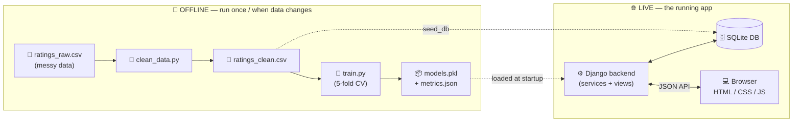

**In words:**

1. **🧹 Clean** — `ml/clean_data.py` turns the messy raw ratings into a tidy file.
2. **🧠 Train** — `ml/train.py` evaluates all 10 algorithms, then trains and saves them.
3. **🌱 Seed** — `seed_db` loads the data into a fast SQLite database (done once).
4. **🌐 Serve** — Django loads the trained models and powers the website + JSON API.
5. **💻 Interact** — your browser fetches data and posts ratings via small JSON calls.

---

## 🧩 Project structure

```
tourist-recommender/
│
├── 📂 data/                     # The raw ingredients
│   ├── attractions.csv          #   15 Algerian attractions
│   └── ratings_raw.csv          #   ~635 messy historical ratings
│
├── 📂 ml/                       # 🧠 The brain (pure Python, no Django)
│   ├── clean_data.py            #   messy CSV  →  clean CSV
│   ├── recommender.py           #   ⭐ ALL 10 algorithms live here
│   ├── train.py                 #   evaluate + train + save every model
│   ├── test_recommender.py      #   ✅ 27 unit tests
│   ├── models.pkl               #   (generated) the trained models
│   └── metrics.json             #   (generated) the comparison scores
│
├── 📂 api/                      # ⚙️ The Django app (site + JSON API)
│   ├── models.py                #   database tables
│   ├── services.py              #   bridges trained models ↔ database
│   ├── views.py                 #   page views + API endpoints
│   └── management/commands/     #   seed_db, create_admin
│
├── 📂 panel/                    # 🛠️ The hand-built admin panel (/admin/)
│
├── 📂 frontend/                 # 🎨 What you see
│   ├── templates/               #   HTML pages
│   └── static/                  #   CSS + JavaScript
│
├── 📂 recommender_project/      # Django config (settings, urls)
├── manage.py
└── requirements.txt
```

> 💡 **Where to look first:** the heart of the project is
> [`ml/recommender.py`](ml/recommender.py) — that's where every algorithm is implemented.

---

## 🛠️ Technologies used

| Layer | Tech | Why |
|---|---|---|
| 🐍 Language | **Python 3.10+** | Backend + machine learning |
| ⚙️ Backend | **Django 5** | Routing, database (ORM), auth, templates |
| 🗄️ Database | **SQLite** | Stores attractions, ratings, users (zero setup) |
| 🧮 ML / data | **NumPy + pandas** | Matrices, similarities, training, cleaning |
| 🎨 Frontend | **HTML + CSS + vanilla JS** | No framework, no build step — easy to read |
| 📊 Charts | **Chart.js** | Admin dashboard visualizations |

> 🚫 **On purpose:** no recommender libraries (like `surprise` or `scikit-learn`)
> and no frontend frameworks. Every moving part is hand-written so it can be
> studied and explained — which is the whole point of the course.

---

## 🧠 The 10 algorithms

All implemented in [`ml/recommender.py`](ml/recommender.py), grouped by family:

| Family | Algorithm(s) | One-line idea |
|---|---|---|
| 📊 **Non-personalized** | Mean ratings · Bias baseline | Same ranking for everyone (great as a reference point) |
| 👥 **User-user CF** | cosine · Pearson | "People with your taste also liked…" |
| 🏛️ **Item-item CF** | cosine · Pearson | "Similar to places you rated highly" |
| 🔢 **Matrix factorization** | SGD · ALS | Learns hidden "taste dimensions" with math |
| 📝 **Content-based** | TF-IDF | Matches the *text* (name, category, description) |
| 🔀 **Hybrid** | Item-item + Content | Blends 65% behavior + 35% text similarity |

Every model shares the **same simple interface**, so they're interchangeable:

```python
model.fit(df)                                  # learn from a table of ratings
model.predict_from_ratings(item_id, ratings)   # score one place for a NEW user
model.recommend(ratings, top_n=5)              # → [(place_id, score), ...]
```

### 📈 Current scores (5-fold cross-validation · 576 ratings · 50 users × 15 places)

| Algorithm | RMSE ↓ | MAE ↓ | P@5 ↑ | R@5 ↑ | NDCG@5 ↑ |
|---|:---:|:---:|:---:|:---:|:---:|
| Mean ratings *(non-pers.)* | 0.903 | 0.732 | 0.381 | 0.816 | 0.619 |
| Bias baseline *(non-pers.)* | 0.908 | 0.730 | 0.381 | 0.816 | 0.619 |
| **User-user CF · cosine** ⭐ *default* | **0.922** | 0.744 | 0.389 | **0.840** | **0.645** |
| User-user CF · Pearson | 0.924 | 0.749 | 0.390 | 0.840 | 0.645 |
| Hybrid (Item-item + content) | 0.979 | 0.795 | 0.387 | 0.834 | 0.635 |
| Matrix factorization · SGD | 0.993 | 0.810 | 0.379 | 0.813 | 0.626 |
| Content-based · TF-IDF | 0.995 | 0.785 | 0.373 | 0.793 | 0.617 |
| Item-item CF · Pearson | 0.969 | 0.777 | 0.382 | 0.817 | 0.630 |
| Item-item CF · cosine | 1.051 | 0.845 | 0.386 | 0.831 | 0.634 |
| Matrix factorization · ALS | 1.332 | 1.054 | 0.374 | 0.800 | 0.613 |

<details>
<summary>🤔 <b>Wait — the plain "Mean" model has the best RMSE. Why isn't it the default?</b></summary>

<br>

Because a low error score can be **misleading**. The non-personalized models
(Mean, Baseline) give the **exact same ranking to everyone** — they predict ratings
well *on average*, but they don't actually personalize anything.

So the served default is the best **personalized** model (lowest RMSE among those that
truly tailor results: *user-user cosine*) — which also happens to win on the ranking
metrics (Recall@5 and NDCG@5). Spotting this trade-off is exactly what the evaluation
part of the course is about. 🎯

> **What's NDCG@5?** *Normalized Discounted Cumulative Gain.* It rewards an algorithm
> for putting the places you'll love **near the top** of the list, not just somewhere
> in the top 5.

</details>

---

## 🚀 Getting started

> **Prerequisites:** Python 3.10 or newer. That's it — SQLite ships with Python.

```bash
# 1️⃣  Enter the project folder
cd tourist-recommender

# 2️⃣  Create & activate a virtual environment
python -m venv myenv
source myenv/Scripts/activate     # Windows (Git Bash)
# myenv\Scripts\activate          # Windows (CMD/PowerShell)
# source myenv/bin/activate       # macOS / Linux

# 3️⃣  Install dependencies
pip install -r requirements.txt

# 4️⃣  Prepare the data & train the models
python ml/clean_data.py           # clean the messy ratings
python ml/train.py                # evaluate + train all 10 models

# 5️⃣  Set up the database
python manage.py migrate          # create the tables
python manage.py seed_db          # load attractions + ratings

# 6️⃣  Create an admin account  (default: admin / admin12345 — change it!)
python manage.py create_admin

# 7️⃣  Run it! 🎉
python manage.py runserver
```

Then open your browser:

- 🌍 **Website** → http://127.0.0.1:8000/
- ⚙️ **Admin panel** → http://127.0.0.1:8000/admin/

> ✅ **Want to check everything works?** Run the test suite:
> ```bash
> python ml/test_recommender.py     # 27 tests, should all pass
> ```

---

## 🎮 How to use it

**👤 As a visitor:**
1. Go to **Places**, browse the attractions (filter by type or search).
2. **Sign up**, then click the ⭐ stars on any place you've visited.
3. Watch the **"Picked for you"** strip update instantly with new recommendations.
4. Visit **Used model** to see *which* algorithm is powering your picks and why.

**🛠️ As an admin** (`/admin/`, staff accounts only):
1. **Dashboard** — see KPIs, rating distributions, and top attractions.
2. **Recommender** — compare all 10 algorithms and **switch the live one** with one click.
3. **Manage data** — full CRUD on attractions, ratings, visitors, and accounts (with CSV export).

---

## 🔌 The JSON API

The frontend talks to the backend through four small endpoints:

| Method | Endpoint | Auth | What it does |
|:---:|---|:---:|---|
| `GET` | `/api/attractions/?q=&type=&limit=&offset=` | — | List / search attractions (paginated) |
| `GET` | `/api/recommendations/?n=` | optional | Your top picks (popular ones if logged out) |
| `GET` | `/api/my-ratings/` | ✅ | Your existing ratings (to pre-fill the stars) |
| `POST` | `/api/rate/` | ✅ | Save a rating → returns fresh recommendations |

<details>
<summary>📬 <b>Example: what happens when you rate a place</b></summary>

<br>

```
You click 4★ on "Tassili n'Ajjer"
   │
   ▼
common.js  ──POST /api/rate/ {attraction_id, rating: 4}──►  Django
                                                              │
                                              saves your rating to the DB
                                                              │
                                          folds it into the live model
                                                              │
   ◄──────── returns your refreshed top picks ───────────────┘
   │
   ▼
The "Picked for you" strip re-renders. No page reload, no retraining. ⚡
```

</details>

---

## 🔄 Common tasks

| I want to… | Do this |
|---|---|
| ➕ Add an attraction | Add a row to `data/attractions.csv`, then `python manage.py seed_db` |
| 🔁 Retrain the models | `python ml/clean_data.py` → `python ml/train.py` → *Reload models* in admin |
| 🔀 Change the live algorithm | Admin → **Recommender** → pick a card → **Apply** |
| ✅ Run the tests | `python ml/test_recommender.py` |
| 👤 Make another admin | `python manage.py create_admin --username NAME --password PASS` |

---

## 🩹 Troubleshooting

| Problem | Fix |
|---|---|
| `no such table` error | Run `python manage.py migrate`, then `seed_db` |
| `FileNotFoundError: models.pkl` | Run `python ml/train.py` first |
| Images don't load | Re-run `seed_db` if you edited `attractions.csv` (the app reads the DB, not the CSV) |
| Admin looks unstyled | Hard-refresh the page (Ctrl/Cmd + Shift + R) |
| Switching algorithm "did nothing" | With only 15 places, several algorithms agree on the top picks — check `/model/` to confirm which is active |

---

## 🚢 Going to production? (beyond the course)

This is a teaching project set up for local use. Before any real deployment:

- [ ] Set `DEBUG = False` in `settings.py`
- [ ] Move `SECRET_KEY` to an environment variable
- [ ] Restrict `ALLOWED_HOSTS`
- [ ] Switch SQLite → PostgreSQL
- [ ] Serve static files via `collectstatic` + WhiteNoise/Nginx
- [ ] Change the default admin password

---

<div align="center">

### 🏜️ Sahara & Sea
*A taste-matched guide to Algeria*

🎓 Recommender Systems course project · Built with Django + from-scratch collaborative filtering
<br>
📸 Photos via [Wikimedia Commons](https://commons.wikimedia.org/) (CC-licensed)

</div>
